# 背景
参考链接：[清华大学图形学实验室发布全球最大的狗细分类数据集](https://cg.cs.tsinghua.edu.cn/ThuDogs/)

狗作为宠物与人类生活密切相关，日益成为一些家庭的重要一员。与此同时，与狗相关的伤害事件和不文明行为频繁见诸于新闻报道，对城市治理提出了新的挑战。这迫切需要采用现代视觉技术来识别狗以及细粒度的品种信息，以加强城市中狗的管理。

目前清华大学图形学实验室发布全球最大的狗细分类数据集已经上传至AI Studio,[点击进入查看Tsinghua Dogs数据集](https://aistudio.baidu.com/aistudio/datasetdetail/66333)


# PaddleX训练
使用PaddleX的API训练代码，当然也可以使用[PaddleX 图形化开发界面](https://www.paddlepaddle.org.cn/paddlex/download)进行训练。
可以参考我在AI Studio的[基于PaddleX的狗狗识别项目](https://aistudio.baidu.com/aistudio/projectdetail/1408595)
```python
# 环境变量配置，用于控制是否使用GPU
# 说明文档：https://paddlex.readthedocs.io/zh_CN/develop/appendix/parameters.html#gpu
import os
os.environ['CUDA_VISIBLE_DEVICES'] = '0'

from paddlex.cls import transforms
import paddlex as pdx


# 定义训练和验证时的transforms
# API说明https://paddlex.readthedocs.io/zh_CN/develop/apis/transforms/cls_transforms.html
train_transforms = transforms.Compose([
    transforms.RandomCrop(crop_size=224), transforms.RandomHorizontalFlip(),
    transforms.Normalize()
])
eval_transforms = transforms.Compose([
    transforms.ResizeByShort(short_size=256),
    transforms.CenterCrop(crop_size=224), transforms.Normalize()
])

# 定义训练和验证所用的数据集
# API说明：https://paddlex.readthedocs.io/zh_CN/develop/apis/datasets.html#paddlex-datasets-imagenet
train_dataset = pdx.datasets.ImageNet(
    data_dir='dog_cls',
    file_list='dog_cls/train_list.txt',
    label_list='dog_cls/labels.txt',
    transforms=train_transforms,
    shuffle=True)
eval_dataset = pdx.datasets.ImageNet(
    data_dir='dog_cls',
    file_list='dog_cls/val_list.txt',
    label_list='dog_cls/labels.txt',
    transforms=eval_transforms)

# 初始化模型，并进行训练
# 可使用VisualDL查看训练指标，参考https://paddlex.readthedocs.io/zh_CN/develop/train/visualdl.html
num_classes = len(train_dataset.labels)
model = pdx.cls.ResNet101_vd_ssld(num_classes=num_classes)

# API说明：https://paddlex.readthedocs.io/zh_CN/develop/apis/models/classification.html#train
# 各参数介绍与调整说明：https://paddlex.readthedocs.io/zh_CN/develop/appendix/parameters.html
model.train(
    num_epochs=100,
    train_dataset=train_dataset,
    train_batch_size=20,
    eval_dataset=eval_dataset,
    lr_decay_epochs=[4, 6, 8],
    learning_rate=0.025,
    save_dir='output/ResNet101_vd_ssld',
    use_vdl=True)
# 预测
result = model.predict('./dog_cls/cairn/n107348.jpg', topk=5)   #记得图片路径
print("Predict Result:", result)
```
由于PaddleX训练的效果不是特别好，因此选择了EasyDL进行训练

# EasyDL训练
### 选择图像分类
选择图像分类任务
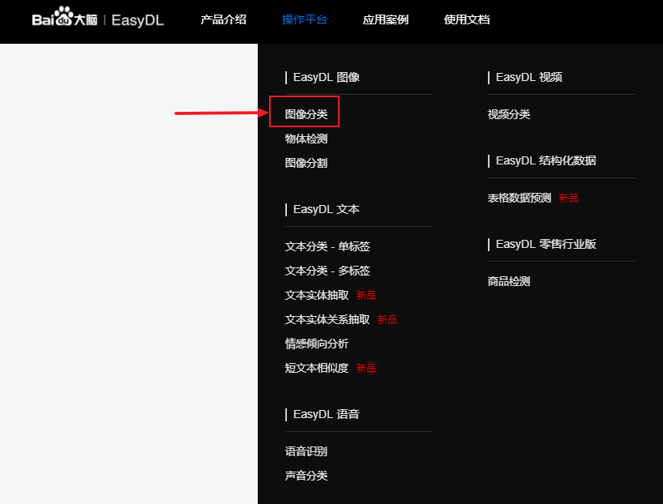
### 创建模型
填写对应的字段名，点击下一步
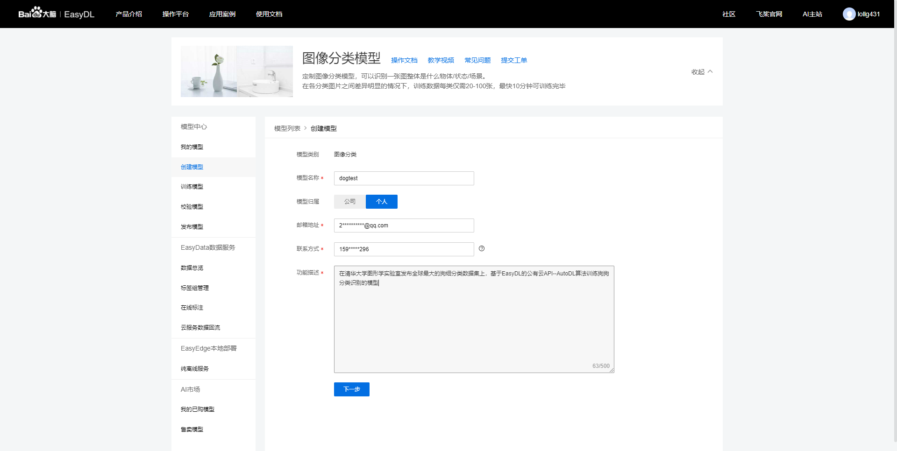
### 创建数据集
点击创建，进行数据集的创建
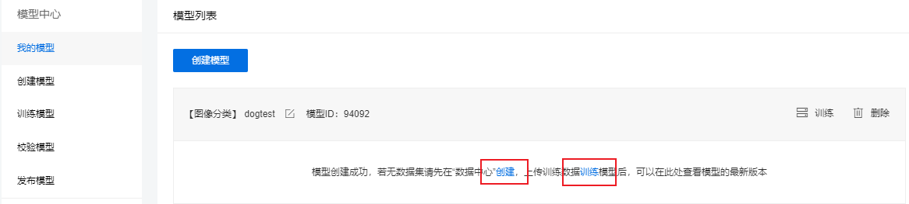
点击导入，可以以多种方式导入数据集，本文以本地导入压缩包
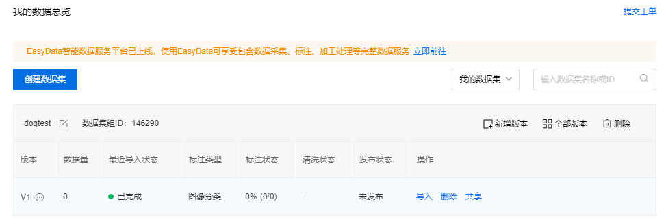
本文数据集可以前往AI studio下载，[点击进入查看Tsinghua Dogs数据集](https://aistudio.baidu.com/aistudio/datasetdetail/66333)
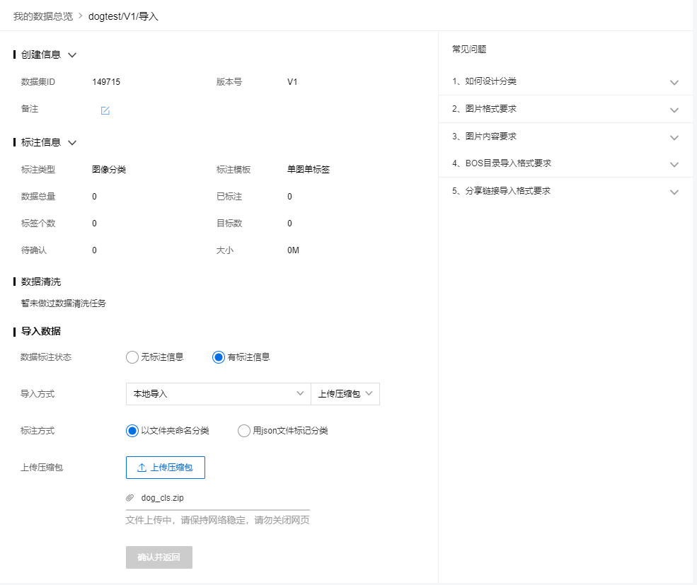
### 训练模型
点击训练模型进入下图，选择公有云部署，选择AutoDL Transfer算法，添加数据集，增加识别结果为其他的默认分类，选择默认配置，点击开始训练
tips:当然上述的算法以及配置都可以根据自己的需求进行调整
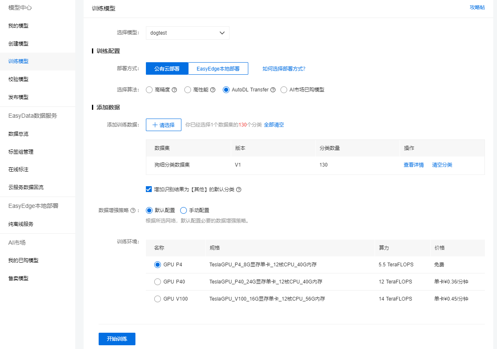
### 查看训练模型
点击我的模型，选择模型，点击完整评估结果查看训练结果
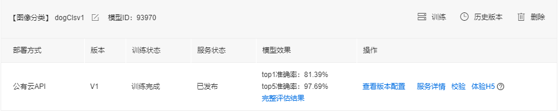

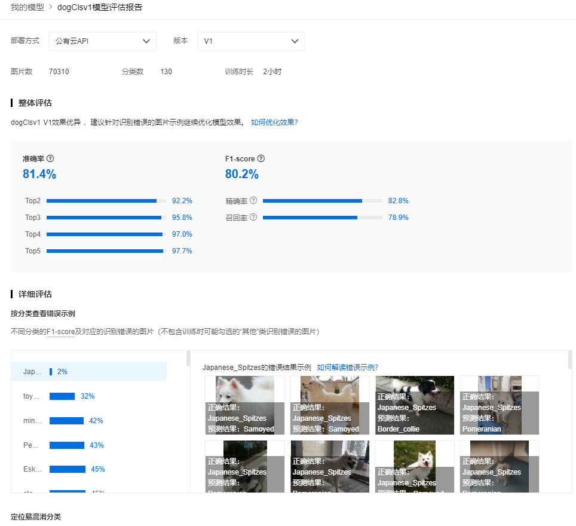

# 网页端部署
点击体验H5进行配置
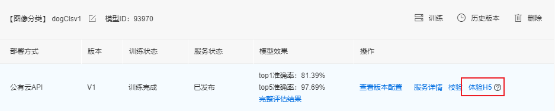

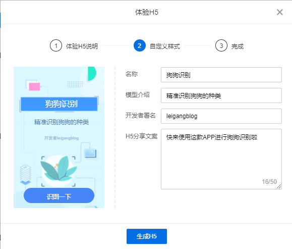
点击进入：
[基于EasyDL的130种狗狗识别分类](https://ai.baidu.com/easydl/h5/93970/a99976d6b859734a53f74da126f14061)

扫码进入：


# 客户端部署
### 技术栈
技术栈：Electron
### Electron介绍
官网：https://www.electronjs.org/
使用 JavaScript，HTML 和 CSS 构建跨平台的桌面应用程序
### 安装Node
```
node -v
npm -v
npm install -g cnpm --registry=https://registry.npm.taobao.org
cnpm -v
```
### 安装electron
```cmd
mkdir dog_cls_win && cd dog_cls_win
cnpm init -y
cnpm i --save-dev electron
```
对package.json和main.js文件进行相关配置,之后进行打包
```cmd
cnpm i electron-builder --dev
npm run dist
```

### 体验客户端
打开客户端：
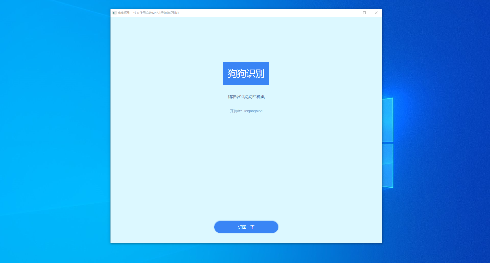
打开客户端文件进行识别：
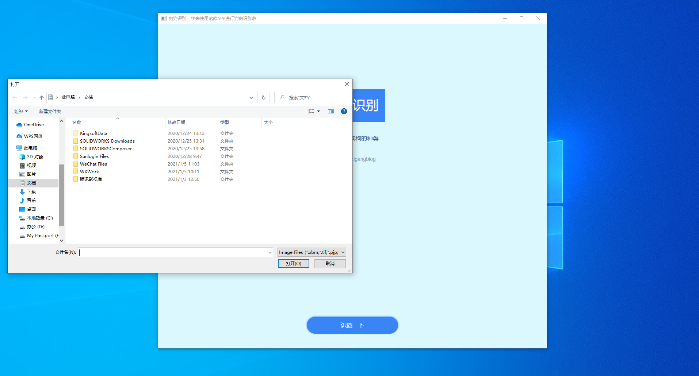
### 
# 手机端部署
### 开发流程
点击下载[HBuilderX](https://www.dcloud.io/hbuilderx.html)
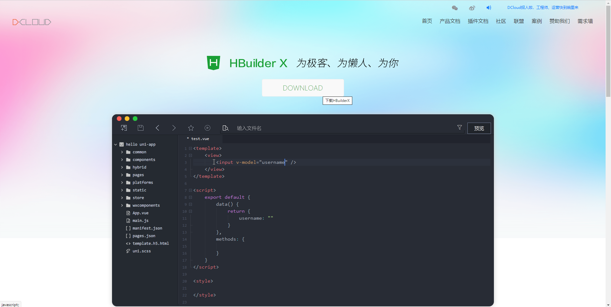
下载App开发版
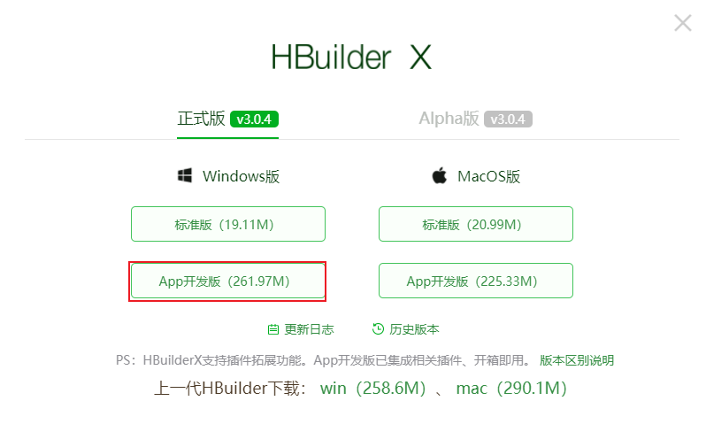
点击新建项目
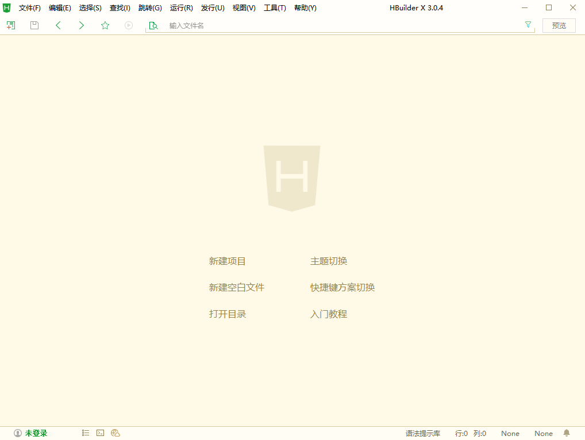
填写相关参数创建项目
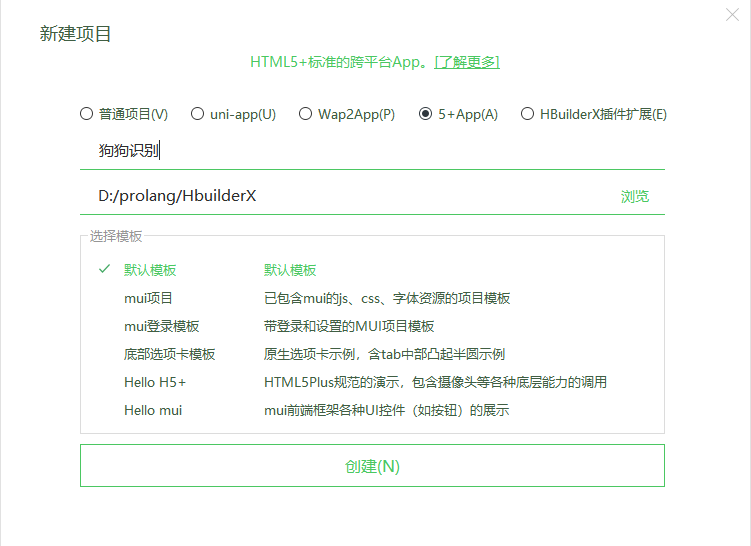
点击mainfest.json进行配置，点击发行->原生APP-云打包
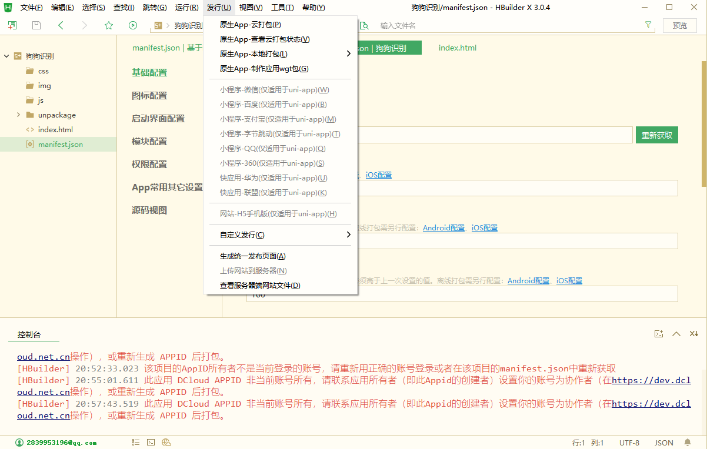
填写相关参数进行打包
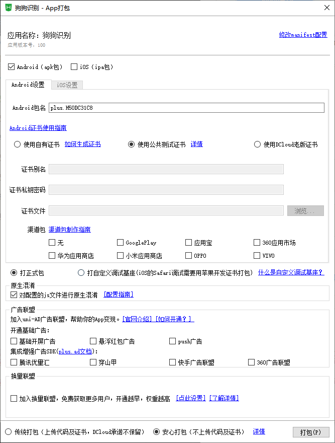
点击打开目录，查看打包后的apk，安装到安卓手机客户端
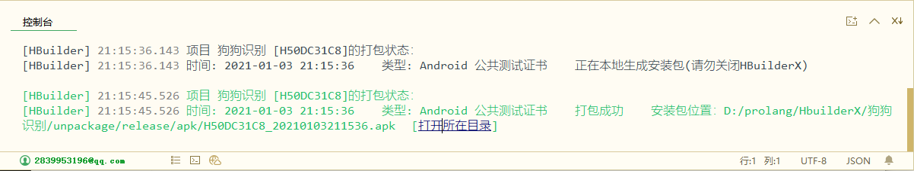

### 体验手机端
手机端体验示意图：
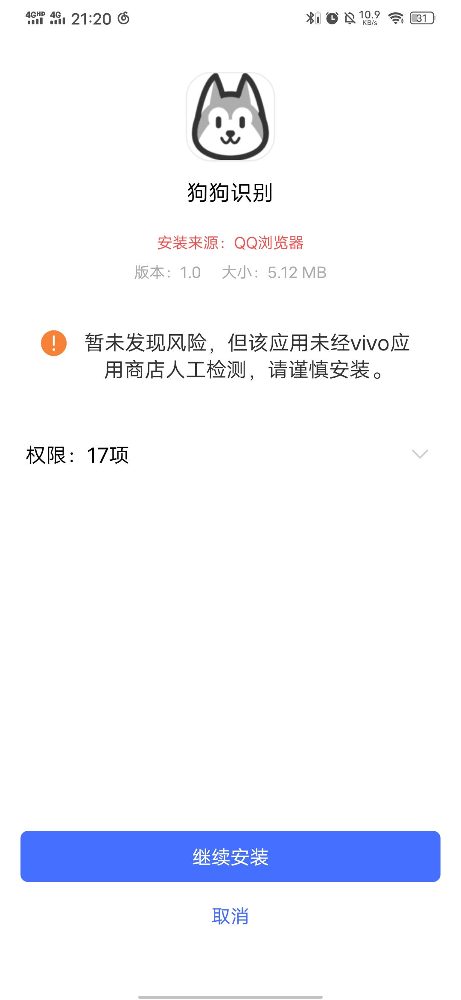
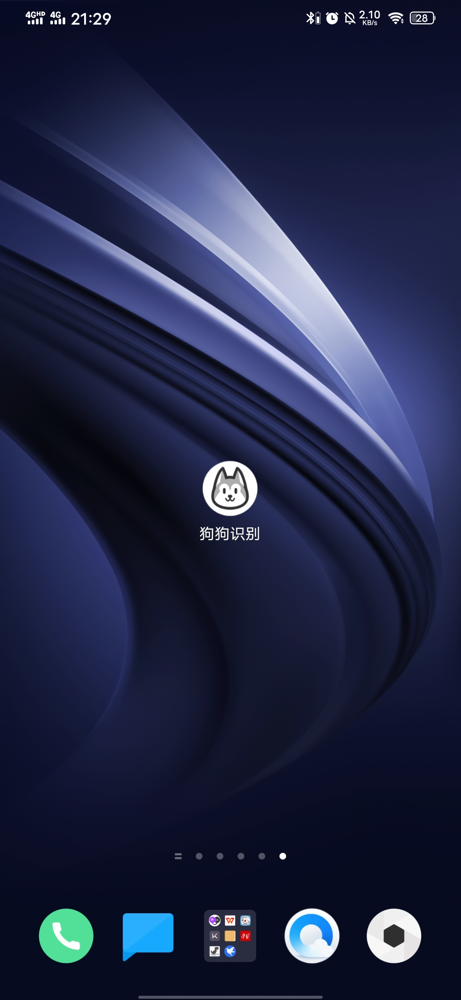


### 安卓端下载
狗狗识别安卓端下载地址：
https://leigang.lanzous.com/iL10kk05egf
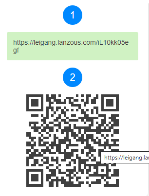

# 小程序端部署
### 开发流程
注册[微信小程序](https://mp.weixin.qq.com/)，下载[微信小程序开发者工具](https://developers.weixin.qq.com/miniprogram/dev/devtools/download.html)，基于[Color UI](https://www.color-ui.com/)进行开发.

期待微信小程序上线！！！

### 体验小程序
扫码即可申请体验：

目前正在审核中：


